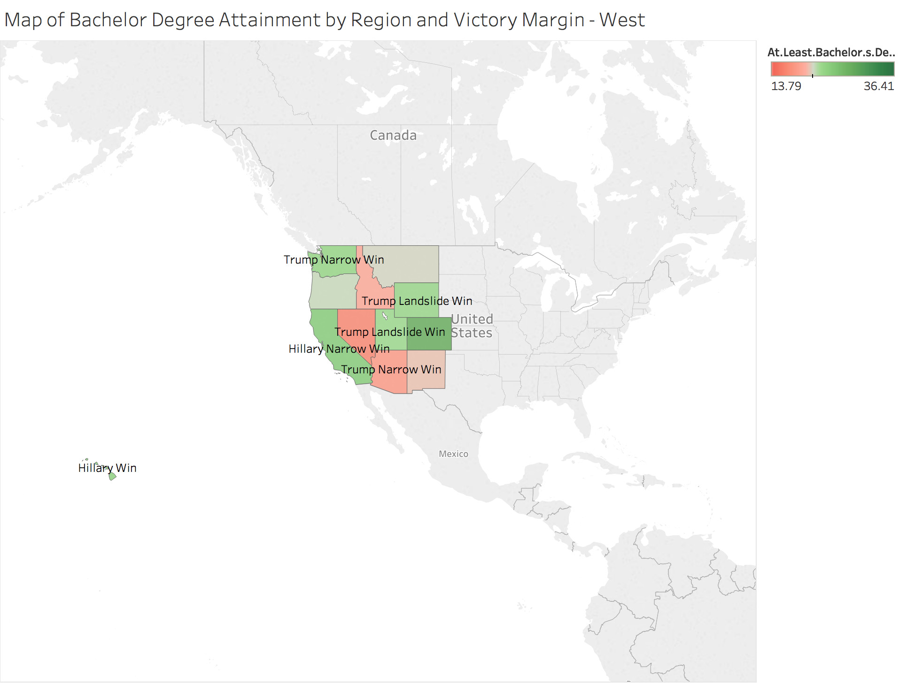
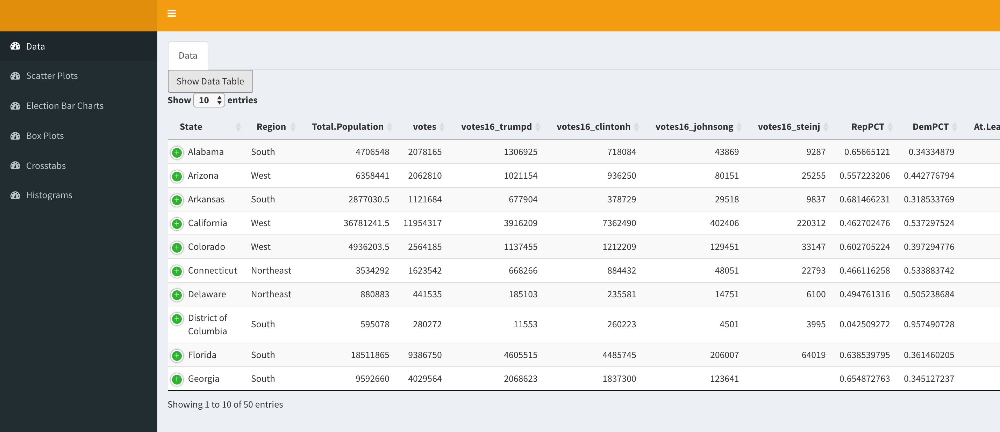

#**Introduction**
</center>

<br>
Our primary dataset includes electoral data, education demographics, ethnic distributions, economics, labor statistics, public health figures and crime rates for the states (excluding Alaska, including District of Columbia) of the United States. The electoral data was collected by <a href="http://www.nytimes.com/elections/results/president">The New York Times</a> and the remaining columns were aggregated by The Ulster Institute for Social Research for a <a href="">publication</a> in the <i> Open Quantitative Sociology & Political Science</i> journal in 2016. Our analysis included the joining of the <a href="https://data.world/uscensusbureau">ACS 2015 Census Data</a> for Economics, Poverty and Race.

To download the cleaned version of this data set, visit <a href="https://data.world/vcjaladi/s-17-dv-final-project">"S17 DV Final Project"</a> published by vcjaladi on data.world. It is a private dataset, so you may request access by emailing vcjaladi\@utexas.edu

#**R Configuration**
Below we display our sessionInfo().

```{r sessionInfo}
sessionInfo(package=NULL)
```

#**The Data**
Here is our data import code. To view a preview of the data, visit the data.world dataset mentioned in the introduction, or view the data summary on the first page of our shiny app, linked below.
```{r, code = readLines('../01 Data/DataImport.R'), eval=FALSE}
```
#**ETL Script**
```{r, code = readLines("../01 Data/ElectionsETL.R"), eval=FALSE}
```

#**Tableau Visualizations**
We utilized a web connector to import our data into Tableau from data.world. We queried census data on data.world and downloaded the results as CSVs to make the import more efficient, and then joined all our tables within Tableau, as shown below.
</center>
<br><br><br>

</center>
<br>
This barchart shows a breakdown of the electoral swing states (created using a set), panelled by the victory margin they fall under. The bar represents the median income in that particular swing state. Each panel includes a reference line showing the average income for the particular victory margin. This visualization shows Hillary only won one swing state, New Hampshire, which has a higher median income than the other swing states. There isn't a panel for a Hillary Landslide victory, further showing that she performed poorly in swing states.
<br><br><br>

</center>
</center>
<br>
The above map shows the bachelor degree attainment in each state, paged by region, and labeled by victory margin. The screenshots show examples of two of the pages, though there are four total regions, which can be viewed in the Tableau workbook. An interesting correlation shown in this map is that regions with predominately Trump victories also generally have lower bachelor's degree attainment.
<br><br><br>

</center>
<br>
This scatterplot graphs the percentage of the population that voted democrat vs. the percentage of the population that is uninsured in each state. The points are colored and sized by a ratio of people in poverty in the given state. The trend line shows a suprising relationship - states with HIGHER uninsured rates voted democratic at LOWER rates. This again supports the idea that Hillary mainly appealed to rich voters, who were likely insured. 
<br><br><br>

</center>
<br>
This dashboard puts together expanded versions of the previous 3 graphs. The bargraph is now for all states rather than just swing states. The map now shows all states rather than being paged by region. 
There is an action implented so that you may highlight a specific state or group of states on the barchart or map, and drill down on those states within the dashboard view. This action can be viewed within the Tableau workbook.
<br><br><br>

</center>
<br>
This histogram shows the count of states with particular percentages of people with an education level below highschool. It is colored by voter turnout. It appears as though states with higher percentages of people without high school diplomas experienced far worse voter turnout.
<br><br><br>

</center>
<br>
The above boxplots show the relationship between unemployment and victory margin, split up by region. It appears that there's no strong relationship between unemployment and victory margin, and it may not have been a key point of contention in voters' minds during this election.
<br><br><br>

</center>
<br>
This crosstab shows median incomes in regions for each victory margin category. It is colored by median income. Again, this visualization supports the idea that Hillary won in states with more wealthy individuals, as her portion of the crosstab are much darker.
<br><br><br>

#**The Shiny Application**
<br>
<a href= https://justinmeunier.shinyapps.io/electionsvisualizations/> Click here to visit the shiny application. </a>
<br><br>
</center>
<br><br><br>

The above screenshot shows the Shiny application, which mirrors but does not exactly replicate our Tableau Visualizations.
<br>
The scatterplot page implements the brush feature, allowing the user to drill down and learn more about specific points of interest on the graph, expanding them into a seperate bar graph.
<br>
The sliders allow the user to change the margin of victory necessary for either candidate to have a "landslide" victory. Move the sliders and use the generate crosstabs button to refresh the plots.
